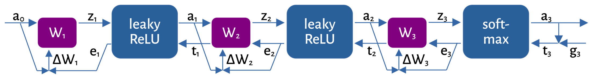

# Trainable Neural Network

Implements a simple neural network that supports on-chip training in addition to inference.
The two hidden layers use leaky ReLU as their activation function while the output layer uses a
rough approximation of softmax.

Unlike usual neural network implementations we use fixed-point saturation arithmetic and
each neuron and synapse is represented as an individual instance.
Inputs, outputs and weights, as well as forward and backward propagation can be managed
through the wishbone bus.

